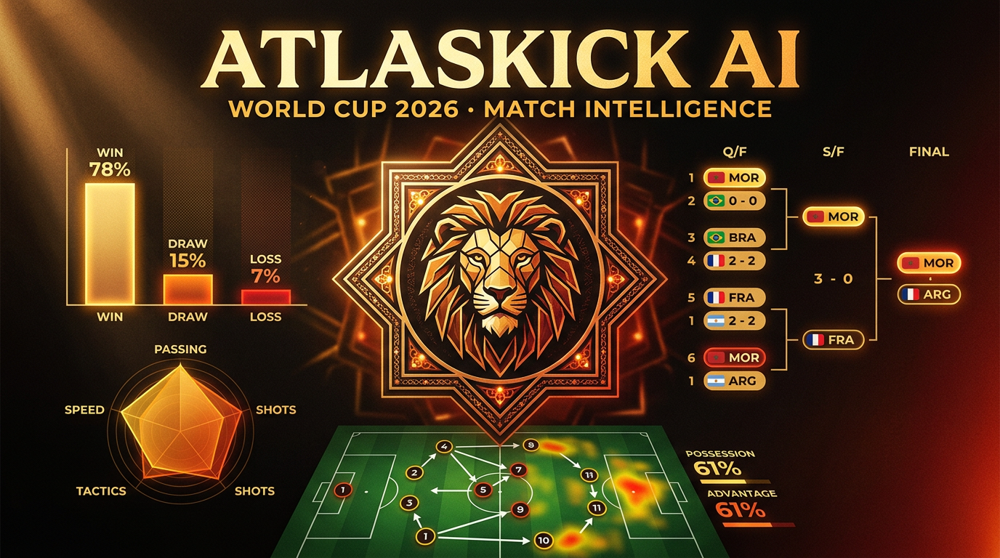

<div align="center">



<h1>AtlasKick&nbsp;·&nbsp;AI</h1>

**An explainable World Cup 2026 football-intelligence platform — with a special Morocco mode.**

Not *"my AI predicts the winner."* Every probability decomposes into named, quantified factors you can interrogate.

<p>
  <a href="https://atlaskick-ai.vercel.app"></a>
</p>

<p>
  
  
  
  
  
  
  
</p>

</div>

---

## What it is

Most prediction apps reduce a match to one opaque number. **AtlasKick does the opposite** — it shows its work. Pick any match and you get win/draw/loss probabilities, expected goals and the most likely scoreline, plus a **SHAP-style breakdown of *why*** (Elo gap, recent form, chance creation, defensive stability, xG balance). It fuses three statistical models, a Monte Carlo tournament simulator and a grounded AI analyst into one live product — deployed with **zero standing infrastructure**.

## ✨ Features

| | |
|---|---|
| 🎯 **Ensemble predictions** | Three models — Elo win-expectancy, Poisson/Dixon-Coles goals, feature logistic — blended and calibrated |
| 🔍 **Explainable (SHAP-style)** | Additive log-odds attributions rendered as a waterfall + plain-English "why", generated from the model's own numbers |
| 🎲 **Monte Carlo simulator** | Replays the remaining bracket 10,000× for each team's round-reach & title odds, with an interactive **what-if lab** |
| 🤖 **Grounded AI analyst** | Llama 3.3 (Groq) answers **only** from live platform data, streams, remembers the chat, cites sources, refuses off-topic |
| ⚡ **Live everything** | Real scores, exact match minute, in-play win probability, formation line-ups, a full-stats **Match Centre** |
| 📊 **Auto-updating boards** | Goals / assists / shots / saves / cards leaderboards + live Elo power rankings with movement arrows |
| 🏆 **Self-advancing bracket** | Winners advance automatically; "winner of X–Y" slots resolve as results land |
| 📈 **Model accuracy tracker** | Freezes each pick pre-kickoff, grades it vs the result — hit rate, Brier score, calibration chart |
| 🇲🇦 **Morocco Mode** | Live journey timeline, next-match panel, squad danger board, attack zones, 2022-vs-2026 — all derived from the live feed |
| 🎨 **"Terracotta Broadcast" design** | Distinctive Moroccan-editorial system, animated gradient signature, scroll-driven motion, fully mobile |

## 🧠 The prediction engine

Three complementary models — using several rather than one demonstrates model comparison and produces a better-calibrated result:

1. **Elo win-expectancy** — rating-difference logistic baseline (long-run team strength)
2. **Poisson / Dixon-Coles goal model** — attack × defense indices → full scoreline probability matrix with a low-score correction
3. **Feature logistic model** — Elo gap, form, chance creation, defensive stability, xG balance, clean sheets

**Explainability** is the point: for a linear model the additive log-odds decomposition *is* the SHAP attribution. AtlasKick computes each feature's contribution, converts it to a percentage-point swing on the win probability, and renders it as a waterfall chart — every sentence of the written explanation maps to a computed number, nothing is invented.

## 🏗️ Architecture

A static SPA with two lightweight cloud attachments — **no backend server, no database**.

```
  Public data sources                    ┌──────────────────────────────┐
  ESPN · worldfootballrankings ─────────▶│  browser live fetch (90s)     │
  · TheSportsDB                          │  ⊕ cloud job every 3 hours    │
                                         └───────────────┬──────────────┘
                                                         ▼
                          pure-TypeScript analytics engine + snapshot.json
                          (Elo · Poisson · ensemble · SHAP · Monte Carlo)
                                                         ▼
                              React + Framer Motion UI  ·  Vercel CDN

  AI path:  question → retrieval context from live tables
                     → serverless Groq proxy (key stays server-side) → streamed answer
                     → deterministic rule-based fallback if the LLM is down
```

## 🛠️ Tech stack

| Layer | Tech |
|---|---|
| Language | TypeScript (strict) |
| UI | React 19 · React Router · Framer Motion |
| Build / style | Vite 8 · Tailwind CSS v4 · CSS-variable design tokens |
| Fonts | Bricolage Grotesque · Instrument Sans · IBM Plex Mono |
| Analytics | Pure-TS engine (`src/engine/`) — Elo, Poisson, logistic, SHAP, Monte Carlo |
| AI | Llama 3.3 70B on Groq, behind a Vercel Edge proxy |
| Data | ESPN API · worldfootballrankings.com · TheSportsDB |
| Automation | Node fetcher on a GitHub Actions 3-hourly cron |
| Hosting | Vercel (static + serverless + CDN) |

## 📡 Live data

- **Live scores, stats & Elo** stream from keyless public sources (ESPN, worldfootballrankings) — refreshed every 90s in the browser and **every 3 hours in the cloud** via GitHub Actions, so the data stays fresh even when the app is closed.
- **Accurate goal counts** via a per-player **maximum across two ESPN feeds** (the aggregate lags on new goals; the live scoreboard misses some old ones — the max is correct for everyone and never over-counts).
- **Graceful fallbacks everywhere** — cached payloads, a bundled snapshot, and a rule-based assistant. The app is never blank.

## 🚀 Getting started

```bash
npm install
npm run dev      # http://localhost:5190
npm run build    # production build
npm run snapshot # regenerate the live data snapshot
```

For the AI assistant in local dev, add a Groq key to `.env`:

```bash
VITE_GROQ_API_KEY=your_dev_key   # dev only — gitignored, never deployed
```

## ☁️ Deployment

Deploys as a static app + one serverless function on **Vercel**. See **[DEPLOY.md](DEPLOY.md)** for the full guide — in short:

1. Push to GitHub (auto-deploy target).
2. Import into Vercel (Vite + the `api/` function auto-detected).
3. Set `GROQ_API_KEY` as a Production env var → redeploy. *(The key stays server-side, never in the bundle.)*
4. Enable the GitHub Actions workflow → stats refresh every 3 hours in the cloud.

## 📄 Disclaimers

Portfolio project. Not affiliated with FIFA. Team ratings and xG indices are the platform's own model values; scores, fixtures and Elo are pulled from public sources.

---

<div align="center">

**Created by Ilyas Daoud El Asmi** &nbsp;·&nbsp; ❤️

<a href="https://atlaskick-ai.vercel.app">Live Demo</a>

</div>
